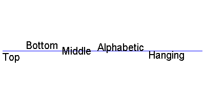

## 一，canvas简介

	#### 	1，什么是canvas

- 是 HTML5 提供的一种新标签

```
<canvas></canvas> 英 ['kænvəs] 美 ['kænvəs] 帆布 画布
```

- Canvas 是一个矩形区域的`画布`，可以用 JavaScript 在上面绘画。控制其每一个像素。
- canvas 使用 JavaScript 绘制图像，本身不具备绘图功能。
- canvas 拥有多种绘制路径、矩形、圆形、字符以及添加图像的方法。
- HTML5 之前的 web 页面只能用一些固定样式的标签：比如 p、div、h1 等

  ####    2，canvas主要应用的领域

1. 游戏：canvas 在基于 Web 的图像显示方面比 Flash 更加立体、更加精巧，canvas 游戏在流畅度和跨平台方面更牛。
   [25 超棒的 HTML5 Canvas 游戏](http://www.oschina.net/news/20143/top-25-best-html5-canvas-games-you-love-to-play)
2. 可视化数据.数据图表，比如:[百度的 echart](http://echarts.baidu.com/)
3. banner 广告：Flash 曾经辉煌的时代，智能手机还未曾出现。现在以及未来的智能机时代，HTML5 技术能够在 banner 广告上发挥巨大作用，用 Canvas 实现动态的广告效果再合适不过。
4. 未来=> 模拟器：无论从视觉效果还是核心功能方面来说，模拟器产品可以完全由 JavaScript 来实现。
5. 未来=> 远程计算机控制：Canvas 可以让开发者更好地实现基于 Web 的数据传输，构建一个完美的可视化控制界面。
6. 未来=> 图形编辑器：Photoshop 图形编辑器将能够 100%基于 Web 实现。
7. 其他可嵌入网站的内容(多用于活动页面、特效)：类似图表、音频、视频，还有许多元素能够更好地与 Web 融合，并且不需要任何插件。
8. 完整的 canvas 移动化应用

### 二，canvas绘图基础

#### 1，canvas 标签语法和属性

- canvas：画布油布的意思 ==英 ['kænvəs] 美 ['kænvəs] ==
- 标签名 canvas，需要进行闭合。就是一普通的 html 标签。
- 可以设置 width 和 height 属性，但是属性值单位必须是 px，否则忽略。
- width 和 hegiht：默认 300*150 像素
- 注意：
  - 不要用 CSS 控制它的宽和高,会走出图片拉伸，
  - 重新设置 canvas 标签的宽高属性会让画布擦除所有的内容。
  - 可以给 canvas 画布设置背景色

#### 2，浏览器不兼容处理

- ie9 以上才支持 canvas, 其他 chrome、ff、苹果浏览器等都支持
- 只要浏览器兼容 canvas，那么就会支持绝大部分 api(个别最新 api 除外)
- 移动端的兼容情况非常理想，基本上随便使用
- 2d 的支持的都非常好，3d（webgl）ie11 才支持，其他都支持
- 如果浏览器不兼容，最好进行友好提示

```
例如：
<canvas id="cavsElem">
  你的浏览器不支持canvas，请升级浏览器.浏览器不支持，显示此行文本
</canvas>
```

- 浏览器不兼容，可以使用*flash*等手段进行优雅降级

#### 2，canvas 绘图上下文 context

- 上下文：上知天文，下知地理。是所有的绘制操作 api 的入口或者集合。
- Canvas 自身无法绘制任何内容。Canvas 的绘图是使用 JavaScript 操作的。
- Context 对象就是 JavaScript 操作 Canvas 的接口。 使用[CanvasElement].getContext(‘2d’)来获取 2D 绘图上下文

```
var canvas = document.getElementById('cavsElem'); //获得画布
var ctx = canvas.getContext('2d'); //注意：2d小写
```

#### 2.1 canvas 坐标系

canvas 坐标系，从最左上角 0,0 开始。x 向右增大， y 向下增大

#### 2.2 设置绘制起点(moveTo)

```javascript
语法：ctx.moveTo(x, y);
解释：设置上下文绘制路径的起点。相当于移动画笔到某个位置
参数：x,y 都是相对于 canvas 盒子的最左上角
注意：绘制线段前必须先设置起点
```

#### 2.3 绘制直线(lineTo)

```
语法：ctx.lineTo(x, y);
解释：从x,y的位置绘制一条直线到起点或者上一个线头点
参数：x,y 线头点坐标
```

#### 2.4 路径开始和闭合

```
开始路径：ctx.beginPath();
闭合路径：ctx.closePath();
解释：如果是绘制不同状态的线段或者形状，必须使用开始新路径的方法把不同的绘制操作隔开。闭合路径会自动把最后的线头和开始的线头连在一起。
beginPath: 核心的作用是将 不同绘制的形状进行隔离，
  每次执行此方法，表示重新绘制一个路径,跟之前的绘制的墨迹可以进行分开样式设置和管理。
```

#### 2.5 描边

```
语法：ctx.stroke();
解释：根据路径绘制线。路径只是草稿，真正绘制线必须执行stroke
```

canvas 绘制的基本步骤：

- 第一步：获得上下文 =>canvasElem.getContext('2d');
- 第二步：开始路径 =>ctx.beginPath()
- 第三步：设置起点 =>ctx.moveTo(x, y)
- 第四步：绘制线(矩形、圆形、图片...) =>ctx.lineTo(x, y)
- 第五步：闭合路径 =>ctx.closePath();
- 第六步：描边 =>ctx.stroke();

html 部分：

```
<canvas id="cavsElem"> 你的浏览器不支持canvas，请升级浏览器 </canvas>
```

javascript 部分：

```
//===============基本绘制api====================
//获得画布
var canvas = document.querySelector('#cavsElem');
var ctx = canvas.getContext('2d'); //获得上下文

canvas.width = 900; //设置标签的属性宽高
canvas.height = 600; //千万不要用 canvas.style.height
canvas.style.border = '1px solid #000';

//绘制三角形
ctx.beginPath(); //开始路径
ctx.moveTo(100, 100); //三角形，左顶点
ctx.lineTo(300, 100); //右顶点
ctx.lineTo(300, 300); //底部的点
ctx.closePath(); //结束路径
ctx.stroke(); //描边路径
```

#### 2.5 填充(fill)

```
* 语法：ctx.fill();
* 解释：填充，是将闭合的路径的内容填充具体的颜色。默认黑色。

* 注意：交叉路径的填充问题，“非零环绕原则”，顺逆时针穿插次数决定是否填充。

    以下是非0环绕原则的原理：（了解即可，非常少会用到复杂的路径）
    “非零环绕规则”是这么来判断有自我交叉情况的路径的：对于路径中的任意给定区域，从该区域内部画一条足够长的线段，
    使此线段的终点完全落在路径范围之外。
    图2-14中的那三个箭头所描述的就是上面这个步骤。
    接下来，将计数器初始化为0，
    然后，每当这条线段与路径上的直线或曲线相交时，
    就改变计数器的值。如果是与路径的顺时针部分相交，则加1，
    如果是与路径的逆时针部分相交，则减1。若计数器的最终值不是0，那么此区域就在路径里面，在调用fill()方法时，
    浏览器就会对其进行填充。
    如果最终值是0，那么此区域就不在路径内部，浏览器也就不会对其进行填充了
```


#### 2.6 快速创建矩形 rect() 方法

```
语法：ctx.rect(x, y, width, height);
解释：x, y是矩形左上角坐标， width和height是宽高 都以像素计
rect方法只是规划了矩形的路径，并没有填充和描边。
```

#### 2.7 快速创建描边矩形和填充矩形

```
语法： ctx.strokeRect(x, y, width, height);
   - 参数同上，注意此方法绘制完路径后立即进行stroke绘制
语法：ctx.fillRect(x, y, width, height);
   - 参数同上， 此方法执行完成后。立即对当前矩形进行fill填充。
```

#### 2.8 清除矩形

```
语法：ctx.clearRect(x, y, width, hegiht);
解释：清除某个矩形内的绘制的内容，相当于橡皮擦。
```

#### 2.9 绘制圆形(arc)

arc() 方法创建弧/曲线（用于创建圆或部分圆）

**提示：**如需通过 arc() 来创建圆，请把起始角设置为 0，结束角设置为 2*Math.PI

**提示：**请使用 stroke() 或 fill() 方法在画布上绘制实际的弧


- arc(100, 75, 50, 0, 1.5*Math.PI)

### 语法

```
context.arc(x,y,r,sAngle,eAngle,counterclockwise);
```

| *x*                | 圆的中心的 x 坐标。                                          |
| ------------------ | ------------------------------------------------------------ |
| *y*                | 圆的中心的 y 坐标。                                          |
| *r*                | 圆的半径。                                                   |
| *sAngle*           | 起始角，以弧度计。（弧的圆形的三点钟位置是 0 度）。          |
| *eAngle*           | 结束角，以弧度计。                                           |
| *counterclockwise* | 默认false，可选。规定应该逆时针还是顺时针绘图。false = 顺时针，true = 逆时针 |

#### 3.0 绘制文字

font 设置或返回文本内容的当前字体属性

textAlign 设置或返回文本内容的当前对齐方式

- start : 默认。文本在指定的位置开始。
- end : 文本在指定的位置结束。
- center: 文本的中心被放置在指定的位置。
- left : 文本左对齐。
- right : 文本右对齐。


textBaseline 设置或返回在绘制文本时使用的当前文本基线

- alphabetic ： 默认。文本基线是普通的字母基线。
- top ： 文本基线是 em 方框的顶端。。
- hanging ： 文本基线是悬挂基线。
- middle ： 文本基线是 em 方框的正中。
- ideographic： 文本基线是 em 基线。
- bottom ： 文本基线是 em 方框的底端



ctx.fillText (text,  x, y, [maxwidth]);  // 用填充的方式来绘制文字

ctx.strokeText (text, x, y, [maxwidth]);  // 用轮廓的方式来绘制文字

| text     | 要绘制的文字                                               |
| -------- | ---------------------------------------------------------- |
| x        | 起点横坐标                                                 |
| y        | 起点纵坐标                                                 |
| maxwidth | 为可选参数，表示显示文字的时候最大的宽度，可以防止文字溢出 |


```
ctx.font = "18px bold 黑体"; //设置字体属性 //设置填充颜色为紫色
ctx.textBaseline = 'bottom'; //设置字体底线对齐基线
ctx.textAlign = 'left'; //设置字体对齐的方式
//ctx.strokeStyle = '#e74c3c';
//ctx.strokeText( "要写的文字", 100, 100 );
ctx.fillStyle = "#3498db";
ctx.fillText("要写的文字", 100, 100); //填充文字
```

#### 3.1，绘制图片

drawImage() 方法在画布上绘制图像、画布或视频。

drawImage() 方法也能够绘制图像的某些部分，以及/或者增加或减少图像的尺寸。

##### 语法1

在画布上定位图像：

```
context.drawImage(img,x,y);
```

##### 语法2

在画布上定位图像，并规定图像的宽度和高度：

```
context.drawImage(img,x,y,width,height);
```

##### 语法3

剪切图像，并在画布上定位被剪切的部分：

```
context.drawImage(img,sx,sy,swidth,sheight,x,y,width,height);
```

| 参数      | 描述                                             |
| :-------- | :----------------------------------------------- |
| *img*     | 规定要使用的图像、画布或视频。                   |
| *sx*      | 可选。开始剪切的 x 坐标位置。                    |
| *sy*      | 可选。开始剪切的 y 坐标位置。                    |
| *swidth*  | 可选。被剪切图像的宽度。                         |
| *sheight* | 可选。被剪切图像的高度。                         |
| *x*       | 在画布上放置剪切图像的 x 坐标位置。              |
| *y*       | 在画布上放置剪切图像的 y 坐标位置。              |
| *width*   | 可选。要使用的剪切图像的宽度。（伸展或缩小图像） |
| *height*  | 可选。要使用的剪切图像的高度。（伸展或缩小图像） |

sx sy swidth sheight  从哪开始剪，剪多长

x y width height 剪完之后放哪里，并重新设置宽高

```
let img = new Image();
img.src= require('./../assets/042.jpg')
img.onload = function(){  ////图片加载完成后，执行此方法
	ctx.drawImage(img,0,0,200,100,100,200,200,200)
}
```


