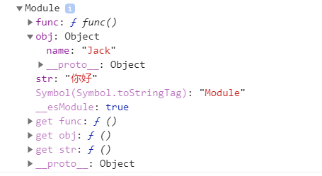
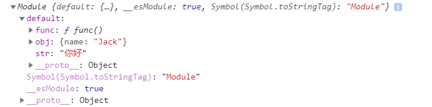

前端工程，在最早的时候是没有模块的概念的。随着前端工程的发展，前端开发也越来越规范化，更像是软件工程了。那么随之而来的，为了解决工程化的问题，就引入了模块的概念。但是在早期，因为ecmascript原本是没有模块语法的，所以采用的都是社区的各种版本协议，其中影响最深的，就是nodejs使用的CommonJS规范

当模块化的概念越来越重要的时候，在es6中，引入了模块的语法：import 

#### 1.export

用于从模块中导出函数、对象或原始值

在使用import的时候，会获取一个文件对象，我们使用export来给这个对象添加内容

m1.js

```
function func(){
  console.log('function ')
}
let obj = {
  name: 'Jack'
}
let str = "你好"

export {
  func, obj, str
}
```

HelloWorld.vue

```
import * as m1 from './m1.js'
export default {
  created(){
    console.log(m1)
  }
}
```



导出的 函数、对象、字符串都变成了这个Module对象的属性

#### 2，export default

文件的默认导出接口

m1.js

```
...
export default{
  func, obj, str
}
```



仅是在上面代码的基础上加了一个 default，可以发现文件对象多了一个default属性，里面包含了所导出的内容

### 3，import

导入整个文件对象

```
import * as m1 from './m1.js'
```

使用 as m_name 来指定一个命名空间对象。

按需导入，对文件对象进行解构，就可以获得其中某一部分接口

```
import { obj } from './m1.js'
```

以上导入方式仅适用于 export 导出

导入 export default 导出的内容

import  m1 from './m1.js'

### 4，import动态导入

import不光是一个关键字，同时也是一个函数，函数的参数是需要导入模块的路径，函数返回一个promise对象。

```
import("./m1.js").then(m=>{
  console.log('then:',m)
})
```

### 5，import不导入文件对象

import还可以不导入文件对象，仅仅是使用文件模块提供的功能。也就是，import将文件模块仅仅作为副作用进行导入，而不获取文件模块的接口

例如一个vue项目，我们需要给vue对象挂载很多东西，但是全部写在`src/main.js` 文件中，又会显得特别啰嗦，不利于维护，也没能体现工程化的理念。所以我们常常单独新建一个文件`lib/init.js` ,然后在这个 `init.js` 文件中，编写相关逻辑。这个文件的作用，仅仅是执行一遍，我们不期望这个文件暴露什么变量，所以没必要获取文件对象。那么这个时候，`import` 关键字的另一个作用就体现出来了：

main.js

```
import './lib/init.js';
```

