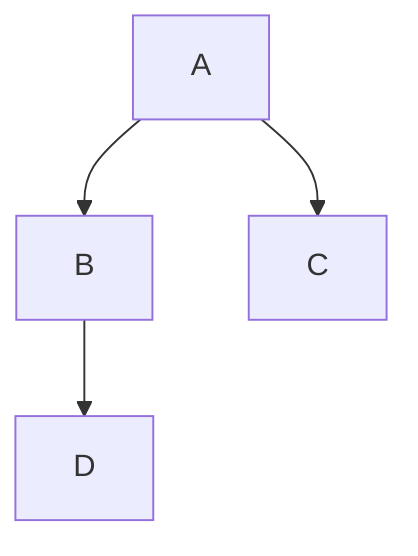
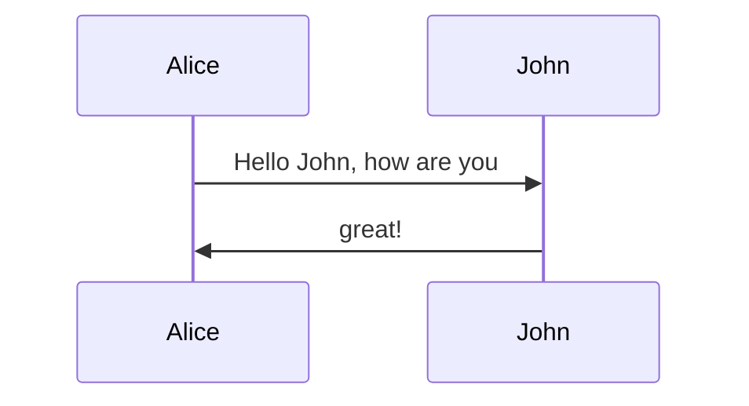
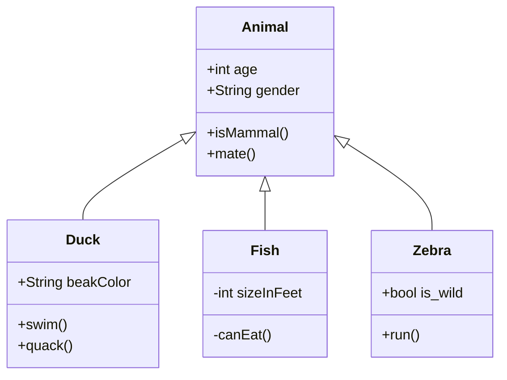
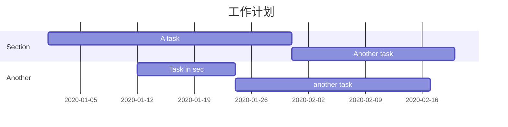
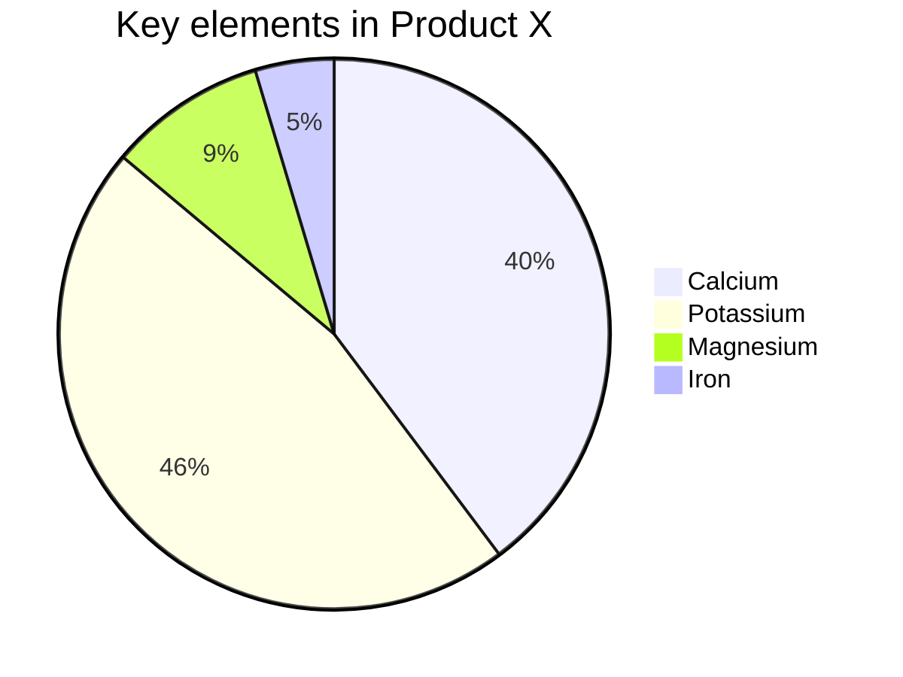

## 一，标题

​	一个#是一级标题，二个#是二级标题，以此类推，支持六级标题。

   注：#后要跟个空格

```
# 一级标题
## 二级标题
### 三级标题
#### 四级标题
##### 五级标题
###### 六级标题
```

效果如下：

# 一级标题
## 二级标题
### 三级标题
#### 四级标题
##### 五级标题
###### 六级标题


## 二，字体

* 加粗

  要加粗的文字左右用两个*号包起来

* 斜体

  要倾斜的文字左右用一个*号包起来

* 斜体加粗

  要倾斜加粗的文字左右用三个***号包起来

* 删除线

  要加删除线的文字左右用两个~~包起来

```
**这是加粗的文字**
*这是倾斜的文字*
***这是倾斜加粗的文字***
~~这是加删除线的文字~~
```

效果如下：

**这是加粗的文字**
*这是倾斜的文字*
***这是倾斜加粗的文字***
~~这是加删除线的文字~~

## 三，引用

在引用的文字前加>即可。引用也可以嵌套，如加两个>>三个>>> 一直到n个

```
>这是引用的内容
>>这是引用的内容
>>>>>>>>>>这是引用的内容
```

效果如下：

> 这是引用的内容
>
> > 这是引用的内容
> >
> > > 这是引用的内容

## 四，分割线

三个或三个以上的-或*都可以

```
---
----
***
*****
```

效果都是一样的：

---

----

***

****

## 五，图片

语法：

```

alt 图片无效时显示
title 鼠标悬停显示，可选，需加引号

![]这种形式图片无法设置大小
可以使用img标签设置大小

文件-偏好设置-插入图片时-复制图片到 ./${filename}.assets文件夹 这样可以统一保存图片，方便移动文件
```


## 六，超链接 

语法：

```
[超链接名](超链接地址 'title')
title 鼠标悬浮显示 可选，需加引号
```

[百度一下](http://www.baidu.com '百度')

## 七，列表

#### 无序列表用 - + * 任何一种都可以

```
- 列表内容
+ 列表内容
* 列表内容
注意：- + * 跟内容之间都要有一个空格
```

效果如下：

- 列表内容

+ 列表内容

* 列表内容

#### 有序列表 使用数字加点

```
1. 列表内容
2. 列表内容
3. 列表内容
注意：序号跟内容之间要有空格
```

效果如下：

1. 列表内容
2. 列表内容
3. 列表内容

#### 列表嵌套

##### 上一级和下一级之间敲三个空格即可

 * 一级内容
   * 二级内容
     * 三级内容
     * 三级内容

1. 一级内容
   * 二级内容
     1. 三级内容
        * 四级内容

## 八，表格

```
|表头|表头|表头|
|-|:-:|-:|
|内容|内容|内容|
|内容|内容|内容|
-两边加：表示文字居中
-右边加：表示文字居右
```

| 姓名 | 年龄 | 性别 |
| :--: | ---- | ---: |
| 杰克 | 24   |   男 |

## 九，代码

#### 单行代码 两边用一个反引号包起来

```
`console.log();`
```

`console.log()`

#### 代码块 两边用三个反引号包起来，且两边的反引号单独占一行

```
function func(){
	console.log();
}
```

## 十，流程图

先在 Typora 中，输入 **```mermaid** 然后敲击回车，即可初始化一张空白图。

#### 1，流程图

```
语法解释：graph 关键字就是声明一张流程图，TD 表示的是方向，这里的含义是 Top-Down 由上至下。
graph TD;
    A-->B;
    A-->C;
    B-->D;
```



#### 2，时序图

```
语法解释：->> 代表实线箭头，-->> 则代表虚线。
sequenceDiagram
    Alice->>John: Hello John, how are you?
    John-->>Alice: Great!
注意：后面的冒号不能省略，得是英文状态下的
```



#### 3，状态图

```
语法解释：[*] 表示开始或者结束，如果在箭头右边则表示结束。
stateDiagram
    [*] --> s1
    s1 --> [*]
```


#### 4，类图

```
语法解释：<|-- 表示继承，+ 表示 public，- 表示 private
classDiagram
      Animal <|-- Duck
      Animal <|-- Fish
      Animal <|-- Zebra
      Animal : +int age
      Animal : +String gender
      Animal: +isMammal()
      Animal: +mate()
      class Duck{
          +String beakColor
          +swim()
          +quack()
      }
      class Fish{
          -int sizeInFeet
          -canEat()
      }
      class Zebra{
          +bool is_wild
          +run()
      }
```



#### 5，甘特图

```
甘特图一般用来表示项目的计划排期，目前在工作中经常会用到。
语法也非常简单，从上到下依次是图片标题、日期格式、项目、项目细分的任务。
gantt
    title 工作计划
    dateFormat  YYYY-MM-DD
    section Section
    A task           :a1, 2020-01-01, 30d
    Another task     :after a1  , 20d
    section Another
    Task in sec      :2020-01-12  , 12d
    another task      : 24d
```



#### 6，饼图

```
饼图使用 pie 表示，标题下面分别是区域名称及其百分比。
pie
    title Key elements in Product X
    "Calcium" : 42.96
    "Potassium" : 50.05
    "Magnesium" : 10.01
    "Iron" :  5
```


