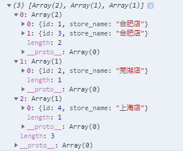
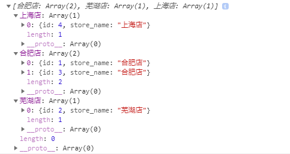
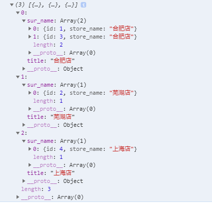
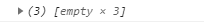
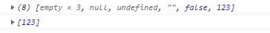

### 1，需求：要求相同名称的放在同一列表下

##### 方法1

```
let storeData = [
    {
        id: 1,
        store_name: "合肥店",
    },
    {
        id: 3,
        store_name: "合肥店",
    },
    {
        id: 2,
        store_name: "芜湖店",
    },
    {
        id: 4,
        store_name: "上海店",
    },
];
    
```

```
let list = storeData,
    flag = 0,
    data = [];
for (let i = 0; i < list.length; i++) {
	let num = "";
    for (let j = 0; j < data.length; j++) {
    	if (data[j][0].store_name == list[i].store_name) { //如果data[j]中有相同的name，
    		flag = 1;
    		num = j;
    		break;
    	}
    }
    if (flag == 1) {
    	data[num].push(list[i]);
    	flag = 0;
    } else if (flag == 0) {
    	let arr = new Array();
    	arr.push(list[i]);
    	data.push(arr);
    }
}
console.log(data);
代码解析：循环每一个list，如果data中有相同name的数据，则把这个list添加到这个二维数组中，如果没有相同name的数据，则新创建一个数组，把这个数组添加到data中
```



##### 方法2

```
let list = storeData,
    flag = 0,
    data = [];
for (let i = 0; i < list.length; i++) {
	if (!data[list[i].store_name]) {
    	let arr = [];
    	arr.push(list[i]);
    	data[list[i].store_name] = arr;
    } else {
    	data[list[i].store_name].push(list[i]);
    }
}
console.log(data);
代码解析：循环每一个list，判断data是不是相同的key，如果有，添加到data中对应的key下，如果没有，新起一个key，添加到data中
```



##### 方法3

```
let list = storeData,
    flag = 0,
    data = [];
for (let i = 0; i < list.length; i++) {
	let num = "";
	for (let j = 0; j < data.length; j++) {
		if (data[j].title == list[i]["store_name"]) {
			flag = 1;
			num = j;
			break;
		}
	}
	if (flag == 1) {
        let store = data[num];
        store.sur_name.push(list[i]);
        flag = 0;
    } else if (flag == 0) {
        let obj = {};
        obj.title = list[i]["store_name"];
        obj.sur_name = new Array();
        obj.sur_name.push(list[i]);
        data.push(obj);
    }
}
console.log(data);
代码解析：还是双重循环，如果data里有相同title，则把list添加到data中sur_name中，如果没有，新起一个对象，添加到data中
```



---

---


如何去掉数组中 empty、undefined 等表示false的值

````
let arr = new Array(3)   //此时输出会有empty
````



```
let arr2 = arr.concat([null,undefined,'',false,123])
let c = arr2.filter(d => d)
console.log(c)
```



