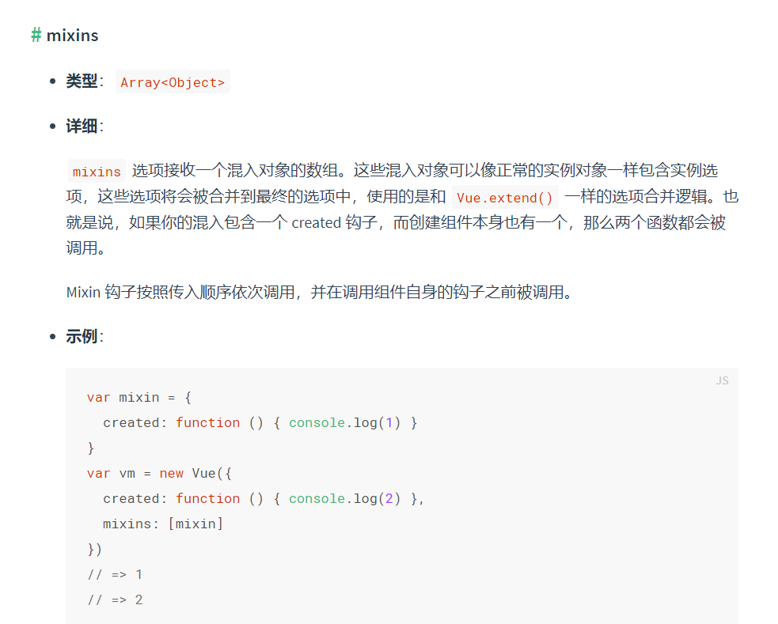
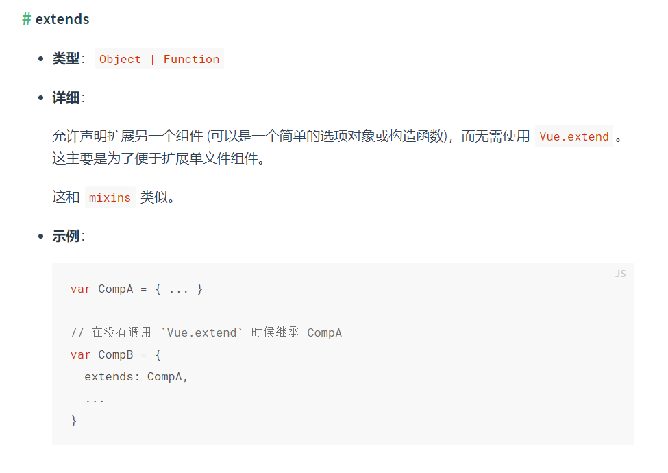

## mixins混入 和 extends继承





其实两个都可以理解为继承，mixins接收对象数组（可理解为多继承），extends接收的是对象或函数（可理解为单继承）

### 钩子函数 都会被调用，输出顺序如下：

```
var extend = {
  created(){
    console.log('extends created')
  }
}
var mixin1 = {
  created(){
    console.log('mixin1 created')
  }
}
var mixin2 = {
  created(){
    console.log('mixin2 created')
  }
}
export default {
  extends: extend,
  mixins: [mixin1, mixin2],
  created(){
    console.log('created')
  }
}
```

控制台输出

```
extends created
mixin1 created
mixin2 created
created
```

结论: 先是extends，然后是mixins(前面的优先级大于后面)，最后是组件自身

### watch 监听器  都会被调用，输出顺序如下：

```
var extend = {
  watch: {
    name(){
      console.log('extends watch')
    }
  }
}
var mixin1 = {
  watch: {
    name(){
      console.log('mixin1 watch')
    }
  }
}
var mixin2 = {
  watch: {
    name(){
      console.log('mixin2 watch')
    }
  }
}
export default {
  extends: extend,
  mixins: [mixin1, mixin2],
  data(){
    return{
      name: 'jack'
    }
  },
  watch: {
    name(){
      console.log('watch')
    }
  }
}
```

控制台输出

```
extends watch
mixin1 watch
mixin2 watch
watch
```

结论：和生命周期输出顺序一样

### methods  会合并为一个对象，对于冲突的method，最终只有一个会生效

```
var extend = {
  methods: {
    say(){
      console.log('extend methods')
    }
  }
}
var mixin1 = {
  methods: {
    say(){
      console.log('mixin1 methods')
    }
  }
}
var mixin2 = {
  methods: {
    say(){
      console.log('mixin2 methods')
    }
  }
}
export default {
  extends: extend,
  mixins: [mixin1, mixin2],
  data(){
    return{
      name: 'jack'
    }
  },
  methods: {
    say(){
      console.log('methods')
    }
  }
}
```

输出 ‘methods‘

结论：合并后的methods对象，对于键值冲突的，以组件自身methods优先，其次是mixins(后面优先级大于前面)，再然后是extends。

优先级最高的那一个生效

### data 

```
var extend = {
  data(){
    return{
      name: 'extend data'
    }
  }
}
var mixin1 = {
  data(){
    return{
      name: 'mixin1 data'
    }
  }
}
var mixin2 = {
  data(){
    return{
      name: 'mixin2 data'
    }
  }
}
export default {
  extends: extend,
  mixins: [mixin1, mixin2],
  data(){
    return{
      name: 'data'
    }
  },
  methods: {
    say(){
      console.log(this.name)
    }
  }
}
```

输出 ‘data‘

结论：和methods一样，合并后的data函数，对于键值冲突的，以组件自身data优先，其次是mixins(后面优先级大于前面)，再然后是extends。优先级最高的那一个生效

### props

```
var extend = {
  props: {
    name: {
      type: String,
      default: 'extend prop'
    }
  }
}
var mixin1 = {
  props: {
    name: {
      type: String,
      default: 'mixin1 prop'
    }
  }
}
var mixin2 = {
  props: {
    name: {
      type: String,
      default: 'mixin2 prop'
    }
  }
}
export default {
  extends: extend,
  mixins: [mixin1, mixin2],
  props: {
    name: {
      type: String,
      default: 'prop'
    }
  },
  methods: {
    say(){
      console.log(this.name)
    }
  }
}
```

输出 'prop'

结论：props  和   methods    data  一样

```
var extend = {
  computed: {
    name(){
      return 'extend computed'
    }
  }
}
var mixin1 = {
  computed: {
    name(){
      return 'mixin1 computed'
    }
  }
}
var mixin2 = {
  computed: {
    name(){
      return 'mixin2 computed'
    }
  }
}
export default {
  extends: extend,
  mixins: [mixin1, mixin2],
  computed: {
    name(){
      return 'computed'
    }
  },
  methods: {
    say(){
      console.log(this.name)
    }
  }
}
```

输出 'prop'

## 总结

​	钩子函数 watch 这两个是一样的：它们都会被执行。优先级如下：

​		extends -> mixin1 -> mixin2 -> self

​	computed  methods  data  props 这四个是一样的，只会有一个生效，优先级如下：

​		self => mixin2 -> mixin1 -> extends