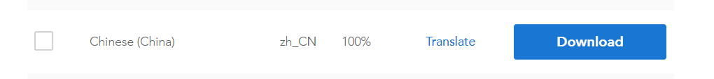
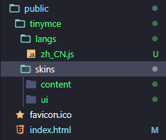
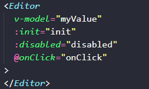

### 1，安装

```shell
npm install @tinymce/tinymce-vue@3.2.6 -S
```

```shell
npm install tinymce -S
```

测试tinymce-vue和tinymce最新版不兼容，所以对其进行降级

### **下载中文语言包**

tinymce提供了很多的语言包，这里我们下载[中文语言包](https://liubing.me/goto/https://www.tiny.cloud/get-tiny/language-packages/)

### 使用

1、在`public`目录下新建`tinymce`，将上面下载的语言包解压到该目录
2、在`node_modules`里面找到`tinymce`,将`skins`目录复制到`public/tinymce`里面
最终形成以下目录形式：



引入基本文件

```
import tinymce from "tinymce/tinymce";
import Editor from "@tinymce/tinymce-vue";
import "tinymce/themes/silver";
```

components中注册tinymce-vue才能使用



初始化配置项，具体参考[官网文档](https://liubing.me/goto/https://www.tiny.cloud/docs/)，这里说几个重要的

```
init: {
	language_url: "/tinymce/langs/zh_CN.js", // 语言包的路径
	language: "zh_CN", //语言
	skin_url: "/tinymce/skins/ui/oxide", // skin路径
	height: 300, //编辑器高度
	plugins: this.plugins,
	toolbar: this.toolbar,
	branding: false, //是否禁用“Powered by TinyMCE”
	menubar: false, //顶部菜单栏显示
	//此处为图片上传处理函数，这个直接用了base64的图片形式上传图片，
	//如需ajax上传可参考https://www.tiny.cloud/docs/configure/file-image-upload/#images_upload_handler
	images_upload_handler: (blobInfo, success, failure) => {
		const img = "data:image/jpeg;base64," + blobInfo.base64();
		success(img);
	},
},
```

## **扩展插件**

默认的编辑器只有基本功能，如果还需要上传图片，插入表格之类的功能就需要添加[插件](https://liubing.me/goto/https://www.tiny.cloud/docs/plugins/)
如添加上传图片和插入表格的插件

```
import 'tinymce/plugins/image'// 插入上传图片插件
import 'tinymce/plugins/media'// 插入视频插件
import 'tinymce/plugins/table'// 插入表格插件
import 'tinymce/plugins/lists'// 列表插件
import 'tinymce/plugins/wordcount'// 字数统计插件
```

引入后还需要再`plugins`上配置和`toolbar`工具栏上添加相应的按钮

```
plugins: {
	type: [String, Array],
	default: "lists image media table textcolor wordcount contextmenu",
},
toolbar: {
	type: [String, Array],
	default:"undo redo | formatselect | bold italic | alignleft aligncenter alignright alignjustify | bullist numlist outdent indent | lists image media table | removeformat",
},
```

## **完整代码Tinymce.vue**

```
<template>
  <div class="tinymce-editor">
    <Editor
      v-model="myValue"
      :init="init"
      :disabled="disabled"
      @onClick="onClick"
    >
    </Editor>
  </div>
</template>

<script>
import tinymce from "tinymce/tinymce";
import Editor from "@tinymce/tinymce-vue";
import "tinymce/themes/silver";
import "tinymce/plugins/image";
import "tinymce/plugins/media";
import "tinymce/plugins/table";
import "tinymce/plugins/lists";
import "tinymce/plugins/contextmenu";
import "tinymce/plugins/wordcount";
import "tinymce/plugins/colorpicker";
import "tinymce/plugins/textcolor";
import 'tinymce/icons/default/icons.min.js'

export default {
  name: "Tinymce",
  components: {
    Editor,
  },
  props: {
    //传入一个value，使组件支持v-model绑定
    value: {
      type: String,
      default: "",
    },
    disabled: {
      type: Boolean,
      default: false,
    },
    plugins: {
      type: [String, Array],
      default: "lists image media table textcolor wordcount contextmenu",
    },
    toolbar: {
      type: [String, Array],
      default:
        "undo redo | formatselect | bold italic | alignleft aligncenter alignright alignjustify | bullist numlist outdent indent | lists image media table | removeformat",
    },
  },
  data() {
    return {
      //初始化配置
      init: {
        language_url: "/tinymce/langs/zh_CN.js", // 语言包的路径
        language: "zh_CN", //语言
        skin_url: "/tinymce/skins/ui/oxide", // skin路径
        height: 300, //编辑器高度
        plugins: this.plugins,
        toolbar: this.toolbar,
        branding: false, //是否禁用“Powered by TinyMCE”
        menubar: false, //顶部菜单栏显示
        //此处为图片上传处理函数，这个直接用了base64的图片形式上传图片，
        //如需ajax上传可参考https://www.tiny.cloud/docs/configure/file-image-upload/#images_upload_handler
        images_upload_handler: (blobInfo, success, failure) => {
          const img = "data:image/jpeg;base64," + blobInfo.base64();
          success(img);
        },
      },
      myValue: this.value,
    };
  },
  mounted() {
    tinymce.init({});
  },
  methods: {
    //添加相关的事件，可用的事件参照文档=> https://github.com/tinymce/tinymce-vue => All available events
    //需要什么事件可以自己增加
    onClick(e) {
      this.$emit("onClick", e, tinymce);
    },
    //可以添加一些自己的自定义事件，如清空内容
    clear() {
      this.myValue = "";
    },
  },
  watch: {
    value(newValue) {
      this.myValue = newValue;
    },
    myValue(newValue) {
      this.$emit("input", newValue);
    },
  },
};
</script>

<style scoped></style>


```

## **封装后使用**

```
<template>
  <div>
    { { msg }}
    <tinymce-editor ref="editor"
      v-model="msg"
      :disabled="disabled"
      @onClick="onClick">
    </tinymce-editor>
    <button @click="clear">清空内容</button>
    <button @click="disabled = true">禁用</button>
  </div>
</template>


<script>
import TinymceEditor from './Tinymce'
export default {
  components: {
    TinymceEditor
  },
  data () {
    return {
      msg: 'Welcome to Use Tinymce Editor',
      disabled: false
    }
  },
  methods: {
    // 鼠标单击的事件
    onClick (e, editor) {
      console.log('Element clicked')
      console.log(e)
      console.log(editor)
    },
    // 清空内容
    clear () {
      this.$refs.editor.clear()
    }
  }
}
</script>

<style>

</style>
```

