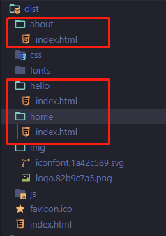

**传统页面和框架开发的区别**

- 传统html是通过a标签跳转来作为切换的，每一个页面都是一个html，这样百度很容易抓取到，也能顺着a链接到你的子级页面。
- 像vue、react、angular开发的都是spa应用，他只有一个页面index，他们都是内加载，动态加载切换路由的，所以你再多页面百度蜘蛛只能爬到首页，这就是spa的一大痛点

**解决方案**

1. vue.js官网提供的 SSR（服务端渲染） 这种方案学习成本高，对于刚开始的新手来说可能有点难度，基本还得重构项目，为了节约开发成本我选择了第二种方案；
2. 预渲染：用vue官方的一句话来说，它无需使用 web 服务器实时动态编译 HTML，而是使用预渲染方式，在构建时 (build time) 简单地生成针对特定路由的静态 HTML 文件。优点是设置预渲染更简单，并可以将你的前端作为一个完全静态的站点。

**预渲染解决步骤**

1. 安装

```
cnpm install prerender-spa-plugin --save
```

2. router.js 将路由模式 设置为 'history'

3. 在vue.config.js配置

```
const PrerenderSPAPlugin = require("prerender-spa-plugin");
const Renderer = PrerenderSPAPlugin.PuppeteerRenderer;
const path = require("path");
module.exports = {
  configureWebpack: (config) => {
    if (process.env.NODE_ENV !== "production") return;
    return {
      plugins: [
        new PrerenderSPAPlugin({
          staticDir: path.join(__dirname, "dist"),
          routes: [
          	"/",
            "/home",
            "/about",
            "/hello"
          ],
          renderer: new PrerenderSPAPlugin.PuppeteerRenderer({
            renderAfterTime: 5000,
          }),
        }),
      ],
    };
  },
};

```

4. 在main.js加入配置

```
new Vue({
  router,
  store,
  render: h => h(App),
  mounted () {
    document.dispatchEvent(new Event('render-event'))
  }
}).$mount('#app')
```

执行打包命令



每个页面都有自己的文件夹，这样就把单页面打包成了多页面

### 关于seo方面的小技巧

- 多使用语义化标签，用header，section、footer把区域模块都划分清楚，这样也有利于蜘蛛爬取
- 多使用h标签，尤其是h1，蜘蛛会认为你这是重要文案
- 给每个页面（mate）添加自己的关键词、描述和标题

### 给每个页面（mate）添加自己的关键词、描述和标题

1. 在路由里配置title、关键词和描述

```
{
    path: '/about',
    name: 'About',
    component: () => import('../views/About.vue'),
    meta: {
			title: '教师培训-恩启官网',
			content: {
				keywords: '教师培训、恩启培训、恩启云课堂、特教老师、线上服务、徐紫薇、王学钢',
				description: '恩启教师培训专注于自闭症行业教师专业技能提升培训，评估师培训。为自闭症康复教师提供科学、系统的在线课程、咨询服务。'
			}
		}
},
```

2. 在路由守卫里判断

```
router.beforeEach((to, from, next) => {
	if (to.meta.content) {
		let head = document.getElementsByTagName('head');
		let meta = document.createElement('meta');
		document.querySelector('meta[name="keywords"]').setAttribute('content', to.meta.content.keywords)
		document.querySelector('meta[name="description"]').setAttribute('content', to.meta.content.description)
		meta.content = to.meta.content;
		head[0].appendChild(meta)
	}
	if (to.meta.title) {
		document.title = to.meta.title;
	}
	next()
});
```

3. 在index.html添加meta标签

```
<meta name="keywords"> 
<meta name="description"> 
```

这样就OK了

假如我们有三个按钮，分别是：北京、上海、深圳，点击进去看到不同的城市信息，但用的都是同一个组件

```
{
	path: '/cityDetail',
	name: 'CityDetail',
	component: () => import('../components/page/CityDetail.vue'),
	meta: {
		title: '',
		content: {
			keywords: '',
			description: ''
		}
	}
},
```

我们没有在路由里进行关键词的填写，因为他要区分好几个城市，我们可以在对应的组件里进行判断

```
if(orgUrl == 'beijing'){
	document.querySelector('meta[name="keywords"]').setAttribute('content', '北京教研中心，恩启教研中心，IEDA教研中心')
	document.querySelector('meta[name="description"]').setAttribute('content', '恩启诞生于2014年 ，是一家专业的自闭症康复机构。北京教研中心，位于北京市朝阳区孙河地铁站对面弘园五号创意生活园A5，联系方式13021253543，北京教研中心。')
	document.title = '恩启IDEA·北京教研中心-直营连锁-恩启官网';
}else if(orgUrl == 'shanghai'){
	document.querySelector('meta[name="keywords"]').setAttribute('content','上海静安教研中心，恩启教研中心，IEDA教研中心');
	document.querySelector('meta[name="description"]').setAttribute('content', '恩启IDEA静安中心坐落于上海市大宁中心广场，毗邻大宁音乐中心，交通便利，生活便捷。');
	document.title='恩启IDEA·上海静安教研中心-直营连锁-恩启官网';
}
```

