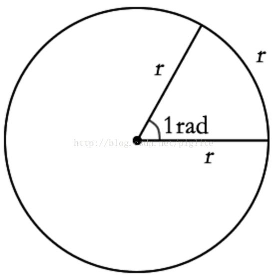

弧度是表示角度大小的另一种方式。即角度的大小除了可以直接用90°,180°这样的数字描述之外，还可以用弧度(rad)来表示。比如，1弧度(1rad)。

当弧长等于半径的长度时，其所对应的圆心角大小就是1弧度（或称为单位弧度）所描述的角的大小：

如图所示，半径长度为r，弧长也为r时，与圆心形成的角度大小就是1弧度(即弧长r/半径r=1)。

如果用数字的形式表示，它是多少呢？我们可以换算一下：

整个圆一周的弧长为2*π*r，此时它所对应的角度大小 用弧度描述就是2πr/r = 2π，而我们知道此时的圆心角用数字表示是360°，因此弧度2π = 数字360° 。也就是约6.28弧度角（π以3.14来计算）的大小为360°，那么1弧度角的大小就是360 / 6.28 ≈ 57.32°