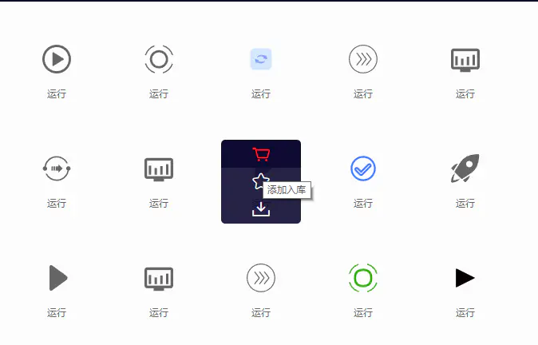
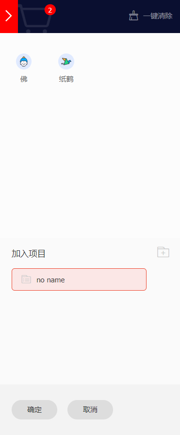
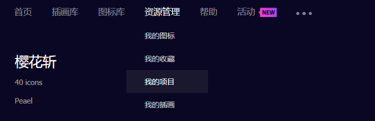
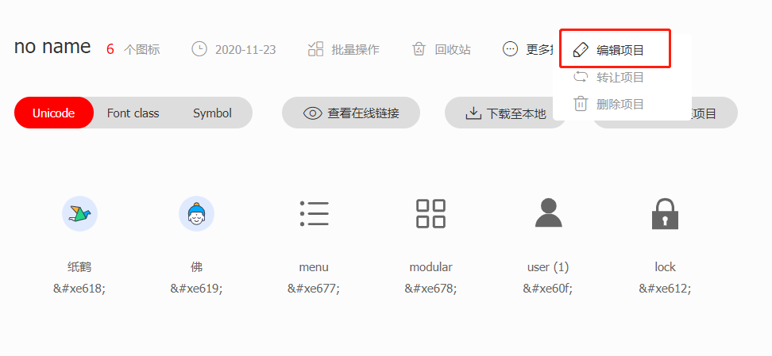
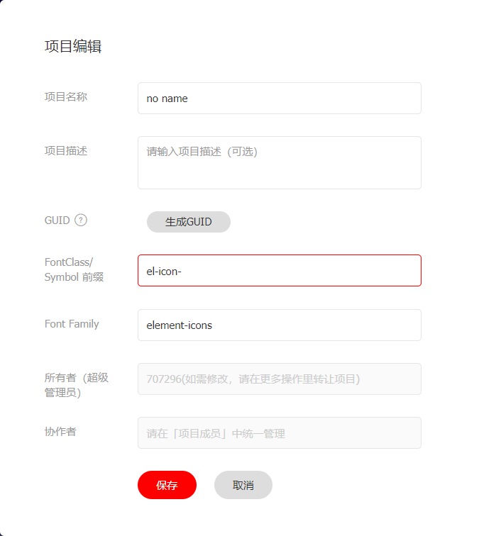
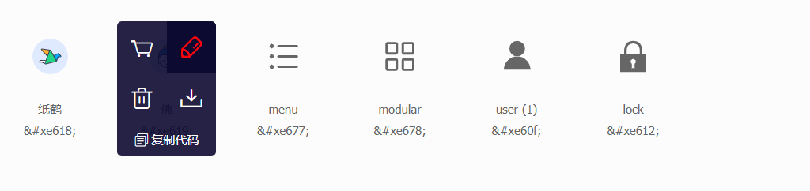
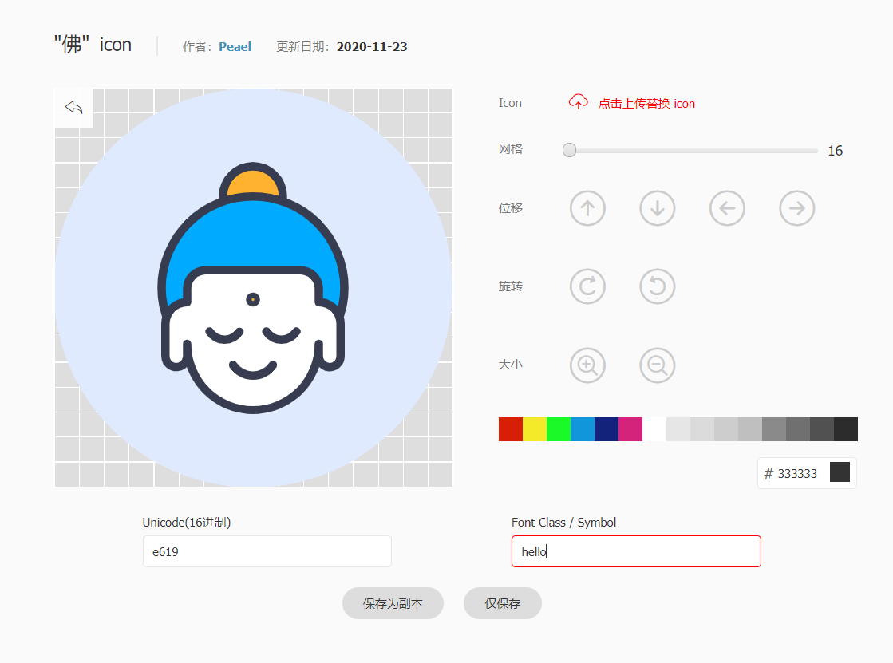
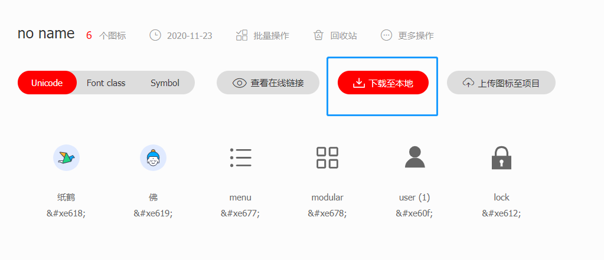
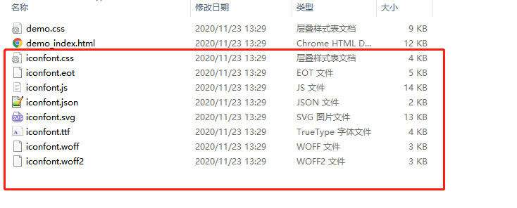
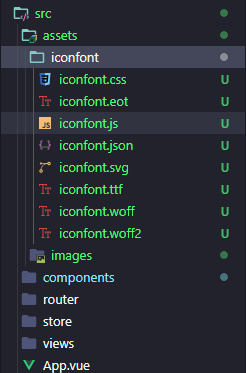

### 1，选择图标

找到我们想要的图标，添加到购物车



### 2，添加项目

点击右上角的购车无图标，确定这些就是我们想要的图标后，点击添加至项目，会让你选择添加到的项目名称



### 3，操作项目

通过 资源管理 => 我的项目 进入项目管理页面



进入项目之后，我们可以看到下方项目中的所有图标，我们首先选择菜单：更多操作 -> 编辑项目，



弹出的项目编辑页面中，我们设置Symbol前缀为：el-icon-，然后将FontFamily设置为`element-icons`，之后点击保存按钮



回到项目页面，依次编辑图标的信息。鼠标悬浮其上，点击小铅笔图标



修改FontClass，我们在项目里引用图标的时候会用到这个字段，请根据项目自行命名修改，之后点击仅保存



回到项目，点击下载到本地，会自动下载一个zip的压缩包



#### 4，图标的使用

下载完毕后，我们将压缩包解压，得到以下文件，我们将下面除了demo.*之外的文件选择后复制到项目中



这是我的工程结构，我把它放到了assets下的iconfont文件夹中，你们也可以根据各自的工程结构放到指定地方



接下来，我们全局引用这个字体图标css样式，在main.js中添加如下import：

```
import '@/assets/iconfont/iconfont.css'
```

最后，我们在我们需要引入图标的地方直接使用即可，class命名规则为：`el-icon-` + Font Class     比如：

```
<i class="el-icon-hello"></i>
```

